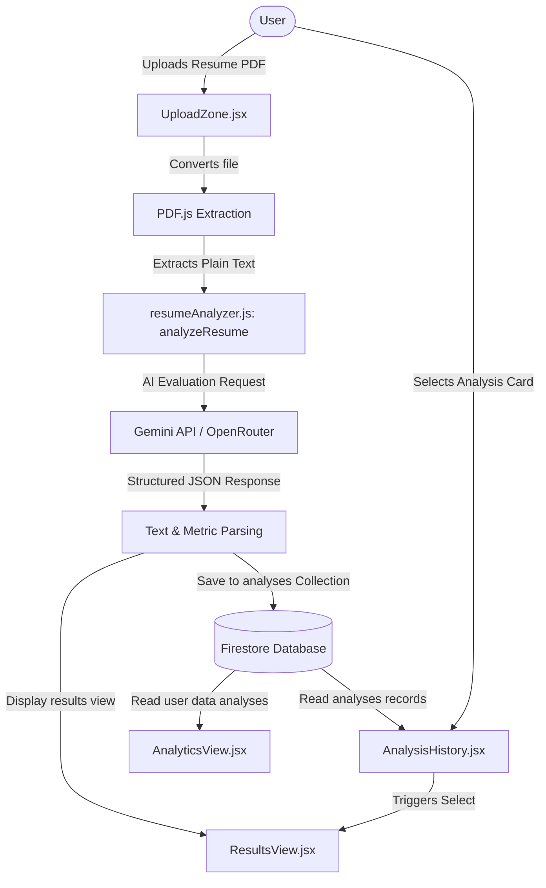

# Developer Documentation: AI-Based Resume Analyzer

Welcome to the technical documentation for the **AI-Based Resume Analyzer**. This document serves as a comprehensive guide for developers to understand the codebase structure, project architecture, authentication flow, database schemas, resume analysis pipeline, and configuration.

---

## 1. Project Overview

*   **Project Name:** AI-Based Resume Analyzer (RESUAI)
*   **Purpose:** A modern, premium Web SaaS platform that enables users to upload resumes (PDF format), extract texts, perform domain-specific parsed ATS/quality analysis using Google's Gemini Models, view detailed metrics, check historical scan records, compile improvements/suggestions, and receive feedback with fully responsive charts and PDF export configurations.
*   **Features:**
    *   Secure Email/Password and OAuth Google Authentication.
    *   Resume parsing and text extraction using PDF.js.
    *   Advanced evaluation scores dynamically calculated using customized weights across career domains.
    *   Resume refinement tool that outputs newly rewritten, optimized resume content.
    *   Interactive KPI analytics charts (ATS score breakdowns, radar charts, trending areas).
    *   Comprehensive scan history table with sorting, filtering, and deletion operations.
    *   Toast system, mobile bottom navigation, and togglable light/dark design theme.
*   **Current Version:** 1.0.0 (Production Stable)

---

## 2. Complete Tech Stack

| Component | Technology | Version / Details |
| :--- | :--- | :--- |
| **Frontend Core** | React | `^19.2.0` (Vite SPA) |
| **Styling** | Vanilla CSS + TailwindCSS | Tailwind `^4.2.1` |
| **State Management** | React Hooks | `useState`, `useEffect`, `useMemo`, `useRef` |
| **Database** | Firebase Firestore | Firestore SDK `^12.10.0` |
| **Authentication** | Firebase Auth | Email/Password, Google Provider |
| **Hosting** | Firebase Hosting | Production CDN |
| **File Storage** | Firebase Storage | PDF Resume uploads |
| **Build Tools** | Vite | `^7.3.1` |
| **Linter / Linting** | ESLint | `^9.39.1` (Flat Configuration) |
| **Animations** | Framer Motion | `^12.35.2` |
| **PDF Extraction** | PDF.js | `pdfjs-dist` `^5.5.207` |
| **AI / NLP Service** | Google Gemini / OpenRouter | Gemini `2.0/2.5-flash` model engines |
| **Data Charts** | Recharts | `^3.8.0` |
| **Icons** | Lucide React | `^0.577.0` |
| **PDF Generation** | jsPDF | `^4.2.1` |

---

## 3. Folder Structure

```text
project-1/
├── .firebase/                  # Internal Firebase temporary cache metadata
├── dist/                       # Output build directory (produced via npm run build)
├── fire/                       # Setup configurations for Firebase features
│   └── .eslintrc.js            # Environment linter configurations for Firebase subprojects
├── functions/                  # Cloud Functions configuration subfolder
│   └── .eslintrc.js            # Linter rules for Cloud Functions
├── public/                     # Static files (icons, default assets, manifest.json)
├── src/                        # Core codebase scope
│   ├── assets/                 # Custom images or style assets
│   ├── components/             # Reusable UI component modules
│   │   ├── AnalysisHistory.jsx # Scanned results records list, filters and search
│   │   ├── BadgeList.jsx       # Badges display list supporting score scale
│   │   ├── BottomNavigation.jsx# Mobile layout bottom tab navigation bar
│   │   ├── Footer.jsx          # Application footer containing branding
│   │   ├── Header.jsx          # Header with title and user dropdown
│   │   ├── Layout.jsx          # Navigation wrapper coordinating Sidebar and Header views
│   │   ├── ScanningProgress.jsx# Circular slider loader displaying stages of analysis progress
│   │   ├── ScoreGauge.jsx      # High fidelity glassmorphic circular score parser gauge
│   │   ├── Sidebar.jsx         # Collapsible desktop left sidebar menu
│   │   ├── SuggestionCard.jsx  # Collapsible breakdown details and tweaks recommendations
│   │   └── UploadZone.jsx      # Drag-and-drop resume upload zone trigger area
│   ├── utils/                  # Utility helper services
│   │   ├── cn.js               # Tailwind class merge utility
│   │   ├── firebaseStorage.js  # Storage upload helpers for PDF reports
│   │   ├── firestoreService.js # Firestore database collection CRUD methods
│   │   └── resumeAnalyzer.js   # PDF extraction (pdf.js) and Gemini API call configurations
│   ├── views/                  # Main page view components
│   │   ├── AnalyticsView.jsx   # Charts dashboard containing Recharts KPI widgets
│   │   ├── AuthView.jsx        # Login, Login/Register toggler and onboarding
│   │   ├── FeedbackView.jsx    # Feedback forms with ratings and attachment upload
│   │   ├── ProfileView.jsx     # User details, cover metrics, and achievement history
│   │   ├── ResultsView.jsx     # Results gauge, improvements feedback, and refinement interface
│   │   ├── SettingsView.jsx    # Theme selectors and notification customizations
│   │   └── UploadView.jsx      # Progress controllers directing scanning flow
│   ├── App.css                 # Global stylesheets
│   ├── App.jsx                 # Central router and state coordination controller
│   ├── firebase.js             # Initializer configuring Firebase App config
│   ├── index.css               # Core styling tokens, color definitions, and utility classes
│   └── main.jsx                # SPA entry point
├── eslint.config.js            # Global linter configuration file
├── firebase.json               # Firebase Host, Functions and Storage routing rules
├── firestore.rules             # Firestore security rules and write validation
├── storage.rules               # Storage bucket security constraints
└── vite.config.js              # Vite React configuration setup
```

### Folder Roles
*   `src/components/`: Pure visual elements, custom gauge components, navigation panels, and list tables.
*   `src/views/`: Primary stateholders corresponding to each routing screen tab.
*   `src/utils/`: Backend abstraction layer containing API triggers, browser state synchronizers, and file extraction logic.

---

## 4. Project Architecture & Data Flow



### Flow Breakdown
1.  **Extraction Action:** The user supplies a PDF file to `UploadZone.jsx` which reads the bytes as inline `ArrayBuffer` and uses `pdf.js` (`extractTextFromPDF`) to retrieve plain text.
2.  **AI Analysis:** The raw text is passed to `resumeAnalyzer.js` (`analyzeResume`). It compiles a prompt representing the resume text and calls Google Gemini API (or OpenRouter interface) requesting a JSON object matching an explicit schema.
3.  **Storage & DB:** The response payload, along with the PDF download link from Firebase Storage (if uploaded), is saved to the Firestore `analyses` collection.
4.  **Dashboard Display:** The active page flips to `ResultsView.jsx`, rendering gauges, suggestions, domain breakdowns, and launching suggestions tweaks.
5.  **Refinement:** If the user applies suggestion tweaks, a rewrite prompt is sent to `refineResume` to return an optimized plain-text layout exporter.

---

## 5. Firebase Integration

All configured services reside in `src/firebase.js`.

*   **Firebase Authentication:** Used for user register, session management, and third-party credential delegation (Google OAuth Provider). Files: `src/views/AuthView.jsx`, `src/App.jsx`.
*   **Firestore Database:** Used to persist resume analysis entries and feedback logs. File: `src/utils/firestoreService.js`.
*   **Firebase Storage:** Used to upload raw resume PDF files. Path bucket is configured inside `storage.rules`. File: `src/utils/firebaseStorage.js`.
*   **Firebase Hosting:** Deploys and serves the static production build (`dist/` folder) to user viewports over public CDNs.

---

## 6. Database Structure

Firestore Collections:

### 1. `analyses`
*   **Purpose:** Stores resume audit metrics, analysis JSON data, document metadata, and timestamps.
*   **Fields:**
    *   `userId` (string): The creator's Firebase uuid link.
    *   `fileName` (string): Original uploaded filename.
    *   `pdfUrl` (string): Firebase Storage download URL path.
    *   `analysisData` (map / object): The detailed JSON output returned by Gemini.
    *   `createdAt` (timestamp): Database collection creation time.
*   **Relationships:** Many-to-One with user profiles (identified via `userId`).
*   **Indexes:** Relies on client-side sorting and query parameters. Security holds constraints limiting document list access.

### 2. `feedback`
*   **Purpose:** Stores user ratings, category indicators, messages, and attachment links.
*   **Fields:**
    *   `userId` (string): Submitting user's ID.
    *   `email` (string): Contact email.
    *   `category` (string): Feedback category (General, Bugs, etc.).
    *   `subject` (string): Brief subject line.
    *   `message` (string): Full message text.
    *   `rating` (number): Star rating (1-5).
    *   `screenshotUrl` (string): Optional attached image storage link.
    *   `status` (string): Administration status (default `'new'`).
    *   `createdAt` (timestamp): Creation timestamp.

---

## 7. Authentication Flow

*   **Registration:** Handled in `AuthView.jsx`. Registers a user via email and password using `createUserWithEmailAndPassword` or `signInWithPopup(googleProvider)`. On successful user creation, user state updates and triggers state setup.
*   **Login:** Traditional sign-in using `signInWithEmailAndPassword`. Autoredirects to core dashboard once Auth state observer `onAuthStateChanged` is updated.
*   **Logout:** Triggered from sidebar or profile menus via client-side `signOut(auth)`. Instantly destroys the session and redirects the GUI back to the authentication screen.
*   **Protected Routing:** Coordination is centralized inside `src/App.jsx`. If `user` is null, the application intercepts the routing and renders only the `<AuthView />` registration interface.

---

## 8. API / Services

### 1. `analyzeResume`
*   **Files:** `src/utils/resumeAnalyzer.js`
*   **Input:** `resumeText` (string)
*   **Output:** Returns a structured JSON promise containing the full score breakdown, candidate details, strengths, missing keywords, and suggestions.
*   **Core Logic:** Routes the prompt to either Google Gemini API (`https://generativelanguage.googleapis.com`) or OpenRouter (`https://openrouter.ai`) context headers depending on current active environment variables.

### 2. `refineResume`
*   **Files:** `src/utils/resumeAnalyzer.js`
*   **Input:** `originalText` (string), `appliedSuggestions` (array)
*   **Output:** Promise returning a fully rewritten plain-text resume version compiling all instructions.

### 3. `uploadPDF`
*   **Files:** `src/utils/firebaseStorage.js`
*   **Input:** `file` (File object), `userId` (string)
*   **Output:** Promise returning the public file download URL string.

---

## 9. Resume Analysis Pipeline

```text
[Resume PDF File] 
       ↓
(1) Drag and Drop (UploadZone.jsx)
       ↓
(2) Plain Text Parsing (extractTextFromPDF)
       ↓
(3) Scanning State Machine (Running scanning metrics 0-100% on ScanningProgress)
       ↓
(4) API Payload Delivery (Sends instructions to AI model endpoint)
       ↓
(5) Score Calculation (Mathematical verification constraint checks)
       ↓
(6) Firestore Preservation (saveAnalysis)
       ↓
(7) Client View Mount (results page renders gauges and Suggestions)
```

**Score Calculation Rule:**
The final ATS score must strictly calculate:
$$Score = (technicalSkills \times 0.25) + (experience \times 0.25) + (education \times 0.15) + (atsKeywords \times 0.15) + (formatting \times 0.15) + (completeness \times 0.05)$$

---

## 10. Third-Party Packages

| Package | Purpose | Used In |
| :--- | :--- | :--- |
| `pdfjs-dist` | Extracts raw text from PDF streams | `src/utils/resumeAnalyzer.js` |
| `framer-motion` | Page fade-ins and interactive layout transitions | Custom card wrappers, loader gauges, indicators |
| `recharts` | Renders Analytics Radar, Area and Bar metrics | `src/views/AnalyticsView.jsx` |
| `jspdf` | Enables users to print/export optimized resume texts | `src/views/ResultsView.jsx` |
| `lucide-react` | SaaS dashboard interface visual elements | Application UI |
| `clsx` / `tailwind-merge` | Utility for conditionally joining CSS class names | Class merging components control |

---

## 11. Environment Variables

Variables are configured in the root `.env` file:

*   `VITE_FIREBASE_API_KEY`: API Key authorizing Firebase app requests.
*   `VITE_FIREBASE_AUTH_DOMAIN`: Auth domain URL.
*   `VITE_FIREBASE_PROJECT_ID`: Firestore project ID.
*   `VITE_FIREBASE_STORAGE_BUCKET`: Storage bucket URL.
*   `VITE_FIREBASE_MESSAGING_SENDER_ID`: ID for Firebase Cloud Messaging.
*   `VITE_FIREBASE_APP_ID`: Firebase Client application ID.
*   `VITE_GEMINI_API_KEY`: Google Generative Language key context.
*   `VITE_OPENROUTER_API_KEY`: Optional OpenRouter Bearer authentication header.

> [!IMPORTANT]
> All environment variables in Vite must carry the `VITE_` prefix to be exposed to client-side code bundles. Never expose raw keys in public Git repositories.

---

## 12. Routing

The routing is client-side managed dynamically using clean view state properties:

| Tab ID | View Title / Page | URL / Navigation target | Protected |
| :--- | :--- | :--- | :--- |
| **upload** | Resume Upload & Scan | Dashboard Main View | Yes |
| **results** | Analysis Results | Detailed ATS Metrics Dashboard | Yes |
| **analytics** | Analytics Overview | Metrics, KPI Charts Radar / Area | Yes |
| **history** | Scan history | Sorting Filters Audit Table | Yes |
| **feedback** | Submit App Feedback | Feedback & screenshot attachment | Yes |
| **profile** | Profile Management | Cover timeline, certifications | Yes |
| **settings** | Project Settings | Theme selector, local notifications | Yes |

---

## 13. Components Catalog

*   **`ScanningProgress`**: Generates a circular loading indicator matching 4 parse stages (Reading PDF, Parsing text, Running ATS, Matching suggestions).
*   **`ScoreGauge`**: Animates the user's score out of 100 within a responsive glassmorphic backdrop.
*   **`SuggestionCard`**: Expandable card component that displays the original text, the proposed improvements, and the final optimized version.
*   **`UploadZone`**: Renders custom icons, drop zone, and triggers file dialog for PDFs.
*   **`Sidebar` / `BottomNavigation`**: Coordinate layout navigation adaptively across desktop/mobile viewports.

---

## 14. Current Features Status

- [x] Secure registration and login workflows
- [x] PDF text parsing and extraction
- [x] LLM evaluation prompts
- [x] Custom ATS score weighing calculation
- [x] Historical audit logs with searchable parameters
- [x] Interactive Recharts KPI dashboard
- [x] PDF refinement tool (interactive edits rewrite)
- [x] Theme Manager (Light & Dark theme switches)
- [x] 100% Fluid mobile responsiveness layout (checked across 320px–1920px viewports)

---

## 15. Known Issues & Developer Notes

*   **React 19 & Exit Transitions:** `AnimatePresence` from Framer Motion with `mode="wait"` occasionally halts during exit hooks inside React 19 SPA runs due to change hooks. To prevent froze renders, component switching in `App.jsx` executes via direct component layout mounts instead of exiting blocks.
*   **PDF.js Worker Setup:** The worker source is initialized dynamically from the static bundle. Developers must ensure the worker script output resolves correctly in target host configurations.
*   **Recharts Layout warning:** In custom responsive layouts, Recharts components require active `%` widths to dynamically calculate chart bounding boxes. Grid properties are configured using flexible wrapper targets.

---

## 16. Deployment & Action Scripts

### Local Run Configuration
1. Install dependencies:
   ```bash
   npm install
   ```
2. Start local Vite development server:
   ```bash
   npm run dev
   ```
   The local application will start at `http://localhost:5173/` (or port offset).

### Build Target Compilation
Generate production distribution output:
```bash
npm run build
```
Vite will compile and output static files into the `dist/` directory.

### Hosting Deployment
Deploy resources using Firebase CLI tools:
1. Authenticate with your Firebase account:
   ```bash
   firebase login
   ```
2. Deploy to hosting CDN:
   ```bash
   firebase deploy --only hosting
   ```

---

## 17. Dependencies Tree Overview

```text
package.json
├── react / react-dom (^19.2.0)
├── vite (^7.3.1)
├── firebase (^12.10.0)
├── framer-motion (^12.35.2)
├── recharts (^3.8.0)
├── pdfjs-dist (^5.5.207)
├── jspdf (^4.2.1)
└── lucide-react (^0.577.0)
```

---

## 18. Security Architecture

1.  **Security Rules (`firestore.rules`):** Checks that users can only write, read, and delete records where `resource.data.userId == request.auth.uid`, securing user data isolation.
2.  **Authentication:** Session state is signed and verified by the Firebase Auth Client APIs.
3.  **Third-Party APIs:** Environment keys are bundled inside production build configurations. For high-volume projects, it is recommended to route LLM requests through a secure serverless backend.

---

## 19. Future Improvements Checklist

*   [ ] Add bulk PDF upload and analysis.
*   [ ] Support `.docx` extension types via third-party parsers inside upload zone.
*   [ ] Implement secure server-side proxy handlers for API keys to remove client exposure.
*   [ ] Integrate email summary alerts showing analysis score progress.

---

## 20. Handover Summary

The **AI-Based Resume Analyzer** is structured as a single-page application (SPA). All key views (Upload, Results, Analytics, History, Profile, etc.) are orchestrated centrally in `App.jsx`. Database storage is fully automated and linked directly matching Firestore collections. To extend features, developers can add new view tabs into `BottomNavigation` / `Sidebar` and set corresponding screens in `App.jsx`.

For style updates, adjust the semantic tokens in `src/index.css`. Code linting uses Flat ESLint and is validated using `npm run lint`.
